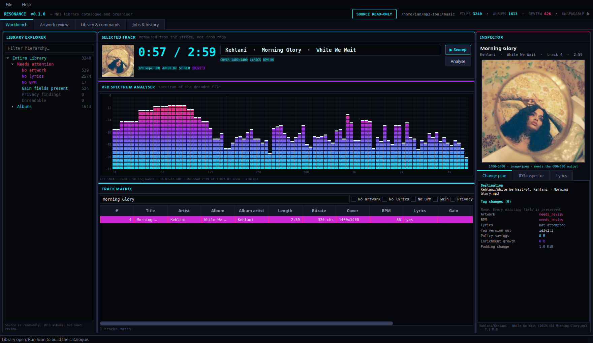

# Resonance

A native C++20 MP3 library manager and player: catalogue, artwork, BPM, lyrics,
privacy and gain cleaning, and safe organisation — with a Qt 6 desktop
application and a CLI sharing one engine.



**Your music is read-only.** Every operation treats the source collection as
untouchable. Version 1 always writes organised *copies* to a separate output
root; it never modifies the original files. The writer refuses any destination
that resolves inside a source root, including through a symlink or a junction,
and it copies the MPEG payload byte for byte so a tag edit provably cannot alter
the audio.

## What it does

| | |
|---|---|
| **Catalogue** | Every discovered tag field in SQLite, including frames it cannot interpret, whose exact payloads are retained and written back unchanged. |
| **Albums** | Provisional grouping with evidence, flagging conflicts rather than guessing. Editions are kept apart; compilations are not split by performer. |
| **Artwork** | Ranks candidates by correctness, then condition, then resolution — never resolution first. A clean 600×600 asset beats a damaged 3000×3000 scan. Outputs a 600×600 JPEG at quality 75. |
| **BPM** | Local analysis. 90% agreement with existing tags on a held-out sample, 0% octave errors. Half/double disagreements go to review, never silent correction. |
| **Lyrics** | LRCLIB matching on artist, title, version *and* duration. "Not found", "instrumental" and "failed" stay three different things. |
| **Privacy** | Removes recognised purchase and account data; preserves public identifiers like MusicBrainz IDs. Unknown private frames go to review, never removal. |
| **Gain** | Removes ReplayGain and Sound Check; preserves gapless information; refuses entirely when MP3Gain undo data is present. |
| **Organisation** | The confirmed template, with collision detection and Windows filesystem preflighting. |
| **Playback** | Play, pause, seek and volume, with a VFD spectrum analyser following the real playhead. |

## Building

Requires a C++20 compiler, CMake 3.22+, and:

```bash
sudo apt install -y build-essential ninja-build cmake pkg-config \
  qt6-base-dev qt6-base-dev-tools qt6-multimedia-dev libgl1-mesa-dev \
  libtag1-dev libsqlite3-dev libjpeg-dev libpng-dev zlib1g-dev \
  libcurl4-openssl-dev
```

```bash
cmake -S . -B build -G Ninja -DCMAKE_BUILD_TYPE=Release
cmake --build build
ctest --test-dir build --output-on-failure
```

Binaries land at `build/src/MusicLibrary.Cli/resonance` and
`build/src/MusicLibrary.Desktop/resonance-desktop`.

The CLI links no Qt module and runs without a display server. Build it alone
with `-DML_BUILD_DESKTOP=OFF`.

## Using it

```bash
# Read-only inventory. Writes nothing to your music.
resonance scan --source /path/to/music --data ~/.local/share/resonance

# Group albums, then see what needs a human decision.
resonance albums --source /path/to/music --data ~/.local/share/resonance
resonance review --source /path/to/music --data ~/.local/share/resonance

# Local analysis: no network, no writes to music.
resonance analyse --source /path/to/music --data ~/.local/share/resonance

# Enrichment. Degrades cleanly with --offline.
resonance artwork --source /path/to/music --data ~/.local/share/resonance
resonance lyrics  --source /path/to/music --data ~/.local/share/resonance

# Compute the exact changes. This command cannot modify a file.
resonance plan --source /path/to/music --output /path/to/output \
               --data ~/.local/share/resonance

# Write the copies, then verify them.
resonance export-copies --source /path/to/music --output /path/to/output \
                        --data ~/.local/share/resonance
resonance verify --source /path/to/music --output /path/to/output \
                 --data ~/.local/share/resonance
```

`resonance --help` lists every command. Exit code `5` means the run completed
but items need review before they can be written.

The desktop application takes the same paths:

```bash
resonance-desktop --source /path/to/music --output /path/to/output
```

## How safety is enforced

Not by convention — structurally.

- `PathGuard` is the only way to obtain write permission. It resolves paths and
  compares device and inode, so a symlink or junction pointing into your music
  is refused even when the path text looks innocent.
- `plan` returns data and touches only the catalogue. It has no writer, so it
  cannot modify a file even if asked to.
- The writer copies the MPEG payload from the source and hashes it, then
  verifies the reopened output against that hash before publishing.
- Output is written to an exclusively-created temporary file, verified, and only
  then renamed into place. An interrupted run leaves no partial file.
- A preservation check compares the complete frame inventory before and after.
  Any unplanned change fails the write.

Measured on a 3240-file collection: every source file byte-identical after a
full scan and an export run.

## Documentation

| | |
|---|---|
| [`docs/requirements.md`](docs/requirements.md) | The functional requirements baseline (FRD v1.3), unchanged. |
| [`docs/traceability.md`](docs/traceability.md) | Every requirement, its status, and the evidence for it. |
| [`docs/progress.md`](docs/progress.md) | What was done, with exact commands and results. |
| [`docs/open-questions.md`](docs/open-questions.md) | What is **not** done, and what is blocked on what. |
| [`docs/adr/`](docs/adr/) | Decisions that deviate from the FRD's suggested components, with reasons. |

If you want to know what this actually does versus what it merely intends to do,
read `docs/traceability.md` and `docs/open-questions.md` together. The first
records what has been verified; the second records what has not.

## Licence

GPL-3.0-or-later. See [`LICENSE`](LICENSE), and `native/DEPENDENCIES.md` for
third-party components and their obligations.
